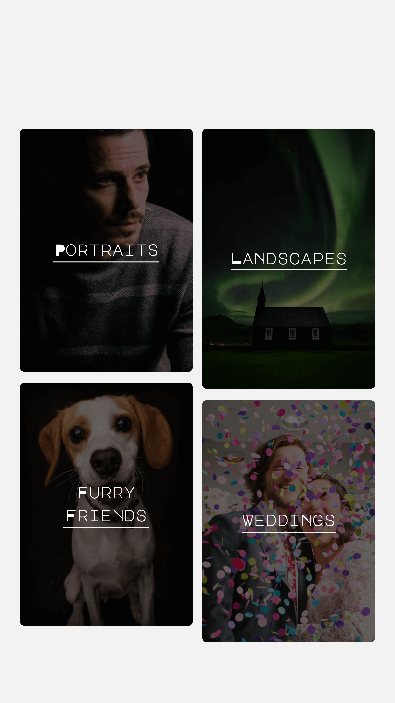
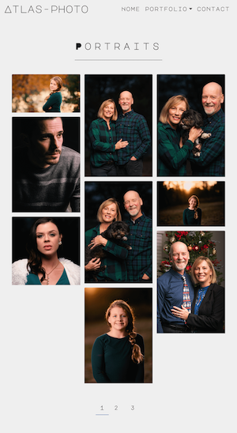
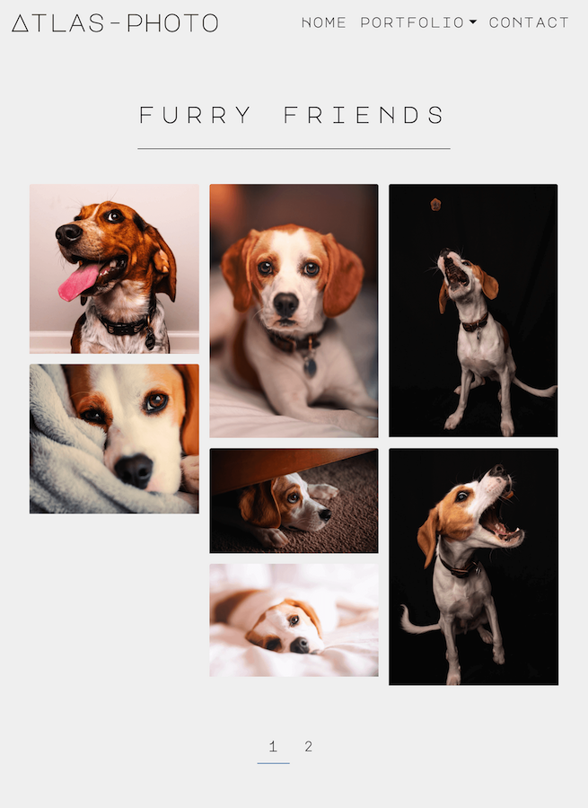
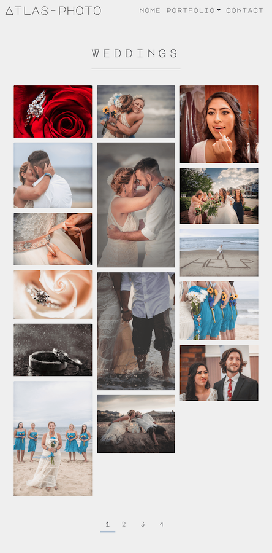
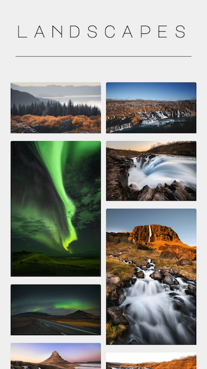

# Atlas-Photo

## A live freelance portfolio built with react and deployed with AWS.

- [Go To Website](https://atlas-photo.com/)

 
 
 

# Technologies Used

- React.js
  - JavaScript
  - lazyLoading/CodeSplitting
  - react-image-appear
  - lodash
- AWS
  - Cloudfront
  - S3
  - Route53
- SASS
  - nodeSASS
  - Bootstrap
  - SVG Animation
